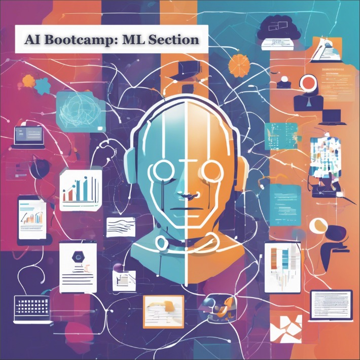

# AI Bootcamp: Machine Learning Track

Welcome!  
This repository contains codes, notebooks, and documentation for the Machine Learning (ML) part of the AI Bootcamp. Each week’s materials are organized into folders and cover the progression of topics, from Python programming basics to advanced ML algorithms and projects.

---

## 📅 Weekly Content Overview

### Weeks 1-2: Introduction & Basics

- Bootcamp introduction
- Essential programming concepts (Python basics)
- Data science roadmap overview

### Weeks 3-4: Math, Stats & Python Essentials

- Crash courses in mathematics and statistics
- Python 2, 3, and 4 session videos and resources

### Weeks 5-7: Python Practice & Databases

- Python problem-solving and mentoring sessions
- SQL introduction, practice, and troubleshooting
- Language tutorial for AI programming

### Weeks 8-10: Project 1 & Data Tools

- **Project 1:** Weather prediction with web data collection
- LinkedIn coding test sample questions
- Linux basics
- Python 11-15 session videos, Git introduction
- Pandas, Numpy, Matplotlib, Seaborn tutorials

### Weeks 11-13: Project 2 & Engineering Tools

- **Project 2:** Building a dashboard for data analysis (e.g., with Streamlit)
- Docker troubleshooting
- Modern AI engineering concepts

### Weeks 14-17: Models & Feature Engineering

- Project 2 discussion
- Optimization and derivative-based optimizers
- Linear Models, Feature Engineering
- Nearest Neighbour, SVM, Decision Trees, Random Forests
- Overfitting, Cross-validation

### Weeks 18-19: Ensemble Models

- Ensemble learning: XGBoost, Boosting, Random Forests

### Weeks 20-21: Project 3 & Unsupervised Learning

- **Project 3 Discussion**
- Clustering algorithms
- Intro to Deep Learning and Artificial Neural Networks (ANN)

### Weeks 22-24: CNNs & Image Processing

- Convolutional Neural Networks (CNN)
- Deep Learning for image processing
- **Project 4:** Object detection in images using image processing and detection algorithms

### Weeks 25-28: RNNs, NLP & Advanced Deep Learning

- Recurrent Neural Networks (RNNs)
- Deep Learning for Time Series and Sequential Data
- Natural Language Processing (NLP), Large Language Models (LLMs), and Transformers
- **Final Project:** Predict NYC taxi trip times using advanced ML, neural networks, and real distance calculations via OSRM in Docker.

---

## 📁 Repository Structure

```
.
├── week01_intro/
├── week02_python_basics/
├── week03_math_stats/
├── ...
├── week08_project1_weather_prediction/
├── ...
├── week12_project2_dashboard/
├── week18_ensemble/
├── week20_project3_clustering/
├── week23_cnn_image_processing/
├── docs/
│   └── additional_materials.md
├── README.md
```

- Each folder contains code, datasets, or notebooks for that week.
- Project folders include sample data, solution code, and relevant documentation.

---

## 💡 How to Use

1. **Clone the repo:**  
   `git clone https://github.com/yourusername/ai-bootcamp-ml.git`
2. **Navigate to each week’s folder** for notebooks, example scripts, and exercises.
3. **Read documentation** in the `docs/` directory for extra resources and references.

Weekly updates coincide with the bootcamp syllabus!

---

## 🤝 Contributing

This repository is for use by AI Bootcamp participants. If you have content to contribute, please open a pull request or contact the course instructor.

---

## 📬 Contact

For any questions or issues, please create an issue in the repository, or contact your instructor directly.

---

Enjoy your learning journey! 🚀

